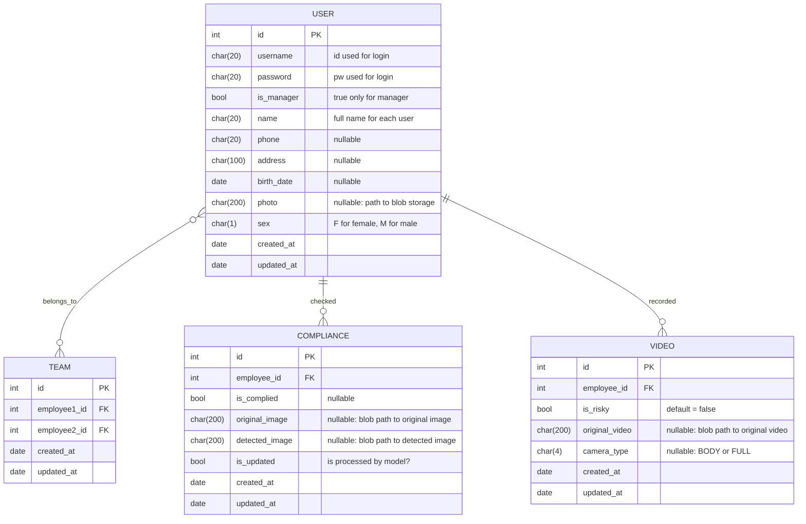

# RiskPulse
### ERD

---

### System Architecture
#### 1. detect worker's regulation compliance

#### 2. detect + save full cam video 

#### 3. upload work-before image then create risk-assessment report

#### 4. detect + save body cam video

---
Last Updated: Feb 13, 2026
