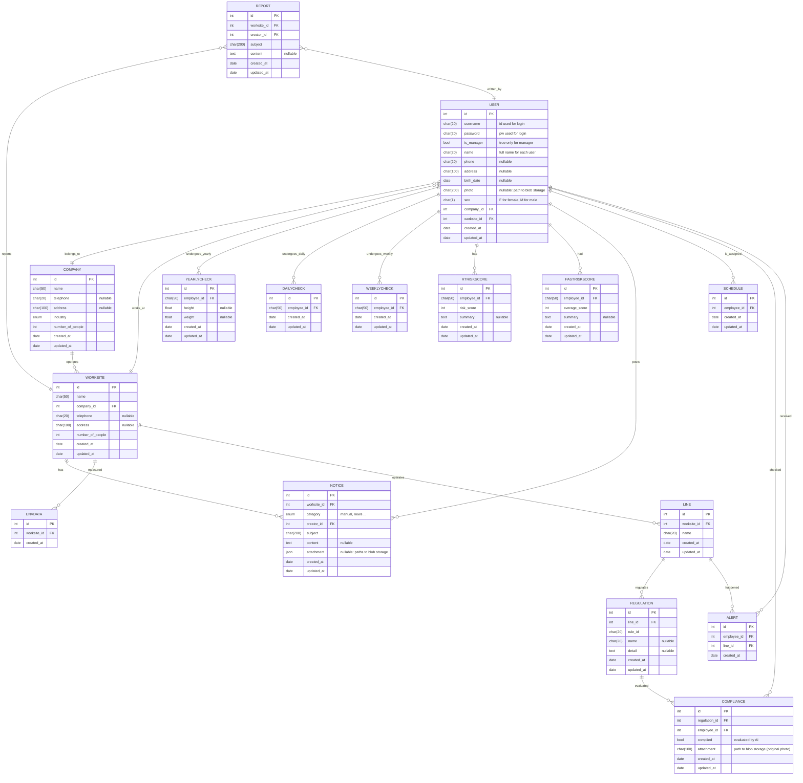

# RiskPulse

### ER Diagram 

```mermaid
erDiagram
    USER  }o--|| COMPANY : belongs_to
    USER }o--|| WORKSITE : works_at
    COMPANY ||--o{ WORKSITE : operates
    USER ||--o{ YEARLYCHECK : undergoes_yearly
    USER ||--o{ DAILYCHECK : undergoes_daily
    USER ||--o{ WEEKLYCHECK : undergoes_weekly
    USER ||--o{ RTRISKSCORE : has 
    USER ||--o{ PASTRISKSCORE : had
    WORKSITE ||--o{ NOTICE : has
    USER ||--o{ NOTICE : posts
    WORKSITE ||--o{ ENVDATA : measured
    REPORT }o--|| WORKSITE : reports
    REPORT }o--|| USER : written_by
    USER ||--o{ SCHEDULE : is_assigned
    WORKSITE ||--o{ LINE : operates
    LINE ||--o{ REGULATION : regulates
    USER ||--o{ COMPLIANCE : checked
    REGULATION ||--o{ COMPLIANCE : evaluated
    USER ||--o{ ALERT : received
    LINE ||--o{ ALERT : happened
    USER {
        int id PK 
        char(20) username "id used for login"
        char(20) password "pw used for login"
        bool is_manager "true only for manager"
        char(20) name "full name for each user"
        char(20) phone "nullable"
        char(100) address "nullable"
        date birth_date "nullable"
        char(200) photo "nullable: path to blob storage"
        char(1) sex "F for female, M for male"
        int company_id FK
        int worksite_id FK
        date created_at
        date updated_at
    }
    COMPANY {
        int id PK
        char(50) name 
        char(20) telephone "nullable"
        char(100) address "nullable"
        enum industry 
        int number_of_people 
        date created_at
        date updated_at
    }
    WORKSITE {
        int id PK
        char(50) name 
        int company_id FK
        char(20) telephone "nullable"
        char(100) address "nullable"
        int number_of_people
        date created_at
        date updated_at
    }
    YEARLYCHECK {
        int id PK
        char(50) employee_id FK
        float height "nullable"
        float weight "nullable"
        date created_at
        date updated_at
    }
    DAILYCHECK {
        int id PK 
        char(50) employee_id FK
        date created_at
        date updated_at
    }
    WEEKLYCHECK {
        int id PK 
        char(50) employee_id FK
        date created_at
        date updated_at
    }
    RTRISKSCORE {
        int id PK 
        char(50) employee_id FK
        int risk_score 
        text summary "nullable"
        date created_at
        date updated_at
    }
    PASTRISKSCORE {
        int id PK 
        char(50) employee_id FK
        int average_score 
        text summary "nullable"
        date created_at
        date updated_at
    }
    NOTICE {
        int id PK
        int worksite_id FK
        enum category "manual, news ..."
        int creator_id FK
        char(200) subject
        text content "nullable"
        json attachment "nullable: paths to blob storage"
        date created_at
        date updated_at
    }
    ENVDATA {
        int id PK
        int worksite_id FK
        date created_at
    }
    REPORT {
        int id PK
        int worksite_id FK
        int creator_id FK
        char(200) subject
        text content "nullable"
        date created_at
        date updated_at
    }
    SCHEDULE {
        int id PK
        int employee_id FK
        date created_at
        date updated_at
    }
    LINE {
        int id PK
        int worksite_id FK
        char(20) name 
        date created_at
        date updated_at
    }
    REGULATION {
        int id PK
        int line_id FK
        char(20) rule_id 
        char(20) name "nullable"
        text detail "nullable"
        date created_at
        date updated_at
    }
    COMPLIANCE {
        int id PK
        int regulation_id FK
        int employee_id FK
        bool complied "evaluated by AI"
        char(100) attachment "path to blob storage (original photo)" 
        date created_at
        date updated_at
    }
    ALERT {
        int id PK
        int employee_id FK
        int line_id FK
        date created_at
    }
```

### System Architecture
#### 1. compute risk score

---
Last Updated: Feb 2, 2026
